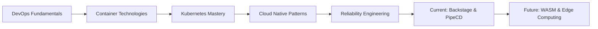

# 👋 Hi there, I'm Pham Thuan

<div align="center">
  


</div>

## 🚀 About Me

I'm a **DevOps Engineer** at **MinhPhuc Transformation**, with a strong passion for **Cloud Native** technologies.

```yaml
apiVersion: v1
kind: Engineer
metadata:
  name: thuanpham582002
  labels:
    role: "DevOps"
    company: "MinhPhuc Transformation"
    focus: "Cloud Native"
spec:
  skills:
    - Kubernetes
    - Docker
    - CI/CD
    - Monitoring & Observability
    - Infrastructure as Code
```

## 🎯 Current Focus

- 🔍 **Cloud Native Architectures**: Designing and implementing cloud-native applications
- ⚙️ **Kubernetes Ecosystem**: Deep diving into K8s, service mesh, and operator patterns
- 📈 **Reliability Engineering**: Implementing monitoring, alerting, and system reliability
- 🤖 **GitOps & Automation**: Infrastructure as Code and continuous deployment

## 📊 GitHub Stats

<div align="center">
  


</div>

## 🏆 Achievements & Certifications

- 🏅 **Certified Kubernetes Administrator (CKA)**

## 🌱 Learning & Growth



## 📫 Connect with me

[](https://linkedin.com/in/tienthuan05082002)
[](mailto:tienthuan05082002@gmail.com)

---

<div align="center">
  


⭐️ From [thuanpham582002](https://github.com/thuanpham582002)

</div>
