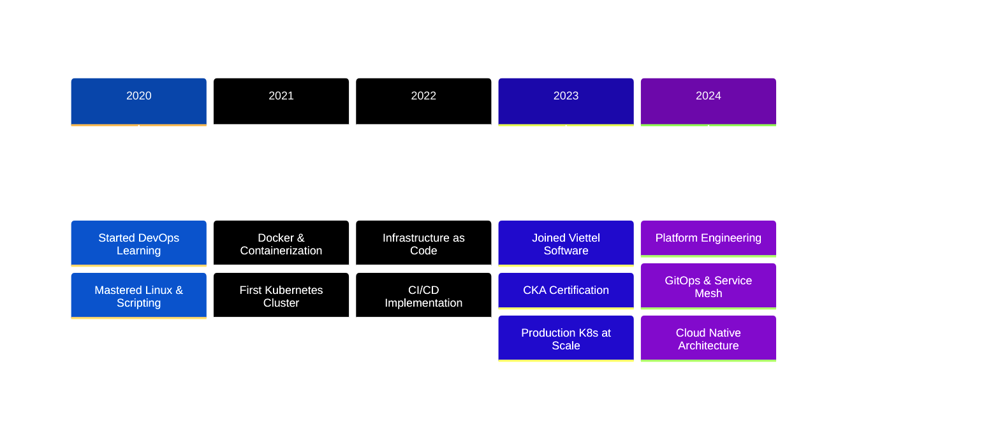

# 🚀 Thuan Pham | DevOps Engineer

---

## 👨‍💻 About Me

<table>
<tr>
<td width="50%">

### 🎯 Current Role
**DevOps Engineer** at **[Viettel Software](https://viettel.com.vn)**  
Building and scaling cloud-native infrastructure for Vietnam's leading tech company.

### 💡 Expertise
- ☸️ Kubernetes & Container Orchestration
- 🏗️ Infrastructure as Code (Terraform, Ansible)
- 🔄 CI/CD Pipeline Engineering
- 📊 Observability & Monitoring (Prometheus, Grafana)
- 🔐 Security & Compliance Automation

</td>
<td width="50%">

### 🎓 Certifications
- 🏅 **Certified Kubernetes Administrator (CKA)**
- 📚 Continuous learner in Cloud Native technologies

### 🌱 Currently Exploring
- Platform Engineering with Backstage
- GitOps with PipeCD & ArgoCD
- Service Mesh (Istio, Linkerd)
- Edge Computing & WebAssembly

</td>
</tr>
</table>

---

## 🛠️ Technology Stack

### Core Technologies

### Cloud & Platforms

### Observability & Monitoring

### CI/CD & GitOps

---

## 📈 GitHub Analytics

<table>
<tr>
<td width="50%">

</td>
<td width="50%">

</td>
</tr>
</table>

---

## 🎯 Professional Journey

---

## 💼 What I Do

<table>
<tr>
<td width="33%" align="center">

### 🏗️ Infrastructure
Design and implement scalable, resilient cloud infrastructure using IaC principles. Automate everything from provisioning to deployment.

</td>
<td width="33%" align="center">

### 🔄 CI/CD
Build robust pipelines that enable teams to ship features faster and safer. Implement GitOps practices for declarative deployments.

</td>
<td width="33%" align="center">

### 📊 Observability
Establish comprehensive monitoring, logging, and tracing solutions. Enable data-driven decisions and proactive incident response.

</td>
</tr>
</table>

---

## 🌟 Philosophy

> *"Infrastructure as Code, Operations as Software, Excellence as Standard"*

**Core Principles:**
- 🔁 Automate repetitive tasks
- 📈 Measure everything
- 🚀 Iterate and improve continuously
- 🤝 Collaborate and share knowledge
- 🔒 Security by design, not afterthought

---

### 📫 Let's Connect!

I'm always interested in discussing DevOps practices, cloud architecture, and technology trends.  
Feel free to reach out for collaboration or just a chat about tech!

---

⭐ *If you find my work interesting, consider starring my repositories!*

