```bash
╔══════════════════════════════════════════════════════════════════════════════╗
║                                                                              ║
║   ████████╗██╗  ██╗██╗   ██╗ █████╗ ███╗   ██╗    ██████╗ ██╗  ██╗ █████╗  ║
║   ╚══██╔══╝██║  ██║██║   ██║██╔══██╗████╗  ██║    ██╔══██╗██║  ██║██╔══██╗ ║
║      ██║   ███████║██║   ██║███████║██╔██╗ ██║    ██████╔╝███████║███████║ ║
║      ██║   ██╔══██║██║   ██║██╔══██║██║╚██╗██║    ██╔═══╝ ██╔══██║██╔══██║ ║
║      ██║   ██║  ██║╚██████╔╝██║  ██║██║ ╚████║    ██║     ██║  ██║██║  ██║ ║
║      ╚═╝   ╚═╝  ╚═╝ ╚═════╝ ╚═╝  ╚═╝╚═╝  ╚═══╝    ╚═╝     ╚═╝  ╚═╝╚═╝  ╚═╝ ║
║                                                                              ║
║                     > DevOps Engineer | Cloud Native Enthusiast             ║
║                     > Kubernetes Specialist @ MinhPhuc Transformation        ║
║                                                                              ║
╚══════════════════════════════════════════════════════════════════════════════╝
```

<div align="center">


</div>

---

## `$ whoami`

```yaml
apiVersion: v1
kind: Engineer
metadata:
  name: thuanpham582002
  namespace: minhphuc-transformation
  labels:
    role: devops-engineer
    specialization: cloud-native
    certification: cka
  annotations:
    location: Vietnam
    email: tienthuan05082002@gmail.com
    linkedin: linkedin.com/in/tienthuan05082002
spec:
  currentFocus:
    - Cloud Native Architectures
    - Kubernetes Ecosystem & Service Mesh
    - Reliability Engineering & SRE Practices
    - GitOps & Infrastructure Automation
  skills:
    core:
      - Kubernetes & Container Orchestration
      - Docker & Containerization
      - CI/CD Pipeline Engineering
      - Infrastructure as Code (Terraform, Ansible)
    observability:
      - Prometheus & Grafana
      - ELK Stack & Logging
      - Distributed Tracing
      - System Monitoring & Alerting
    cloudNative:
      - Service Mesh (Istio, Linkerd)
      - Helm & Kustomize
      - Operator Pattern
      - Backstage & PipeCD
  certifications:
    - name: Certified Kubernetes Administrator
      issuer: CNCF
      status: active
status:
  phase: Running
  conditions:
    - type: Ready
      status: "True"
      reason: ProductionReady
  uptime: 365d+
```

---

## `$ kubectl get achievements --all-namespaces`

```bash
NAMESPACE           NAME                            STATUS    AGE
certifications      certified-kubernetes-admin      Active    1y
projects            cloud-migration                 Success   6mo
projects            k8s-cluster-optimization        Success   4mo
learning            backstage-platform              InProgress 2mo
learning            pipecd-deployment               InProgress 1mo
skills              container-orchestration         Mastered  2y
skills              infrastructure-automation       Mastered  2y
```

---

## `$ docker images | grep skills`

<details>
<summary>🐳 <b>Container Technologies</b> - Click to expand</summary>

```bash
REPOSITORY                    TAG              SIZE      DESCRIPTION
kubernetes/kubectl            latest           245MB     Container orchestration expert
docker/engine                 stable           180MB     Containerization specialist
helm/helm                     v3               120MB     Package management for K8s
istio/istio                   1.20            350MB     Service mesh implementation
```

</details>

<details>
<summary>☁️ <b>Cloud & Infrastructure</b> - Click to expand</summary>

```bash
REPOSITORY                    TAG              SIZE      DESCRIPTION
terraform/terraform           latest           80MB      Infrastructure as Code
ansible/ansible               latest           120MB     Configuration management
prometheus/prometheus         latest           220MB     Metrics & monitoring
grafana/grafana              latest           310MB     Observability platform
```

</details>

<details>
<summary>⚙️ <b>CI/CD & Automation</b> - Click to expand</summary>

```bash
REPOSITORY                    TAG              SIZE      DESCRIPTION
jenkins/jenkins               lts              450MB     Automation server
github/actions-runner         latest           180MB     GitHub Actions
argocd/argocd                latest           250MB     GitOps continuous delivery
gitlab/runner                 latest           200MB     GitLab CI/CD
```

</details>

---

## `$ kubectl top engineer thuanpham582002`

<div align="center">

| METRIC | VALUE | TREND |
|--------|-------|-------|
| 📊 **Commits** |  | |
| 🔥 **Streak** |  | |
| 💻 **Languages** |  | |

</div>

---

## `$ cat ~/.bash_history | tail -n 20`

```bash
# Career Journey & Learning Path
2020-01  > cd ~/education && graduate bachelor-computer-science
2021-06  > docker run --rm learning/devops-fundamentals
2021-12  > kubectl apply -f first-k8s-cluster.yaml
2022-03  > terraform init && terraform apply --auto-approve
2022-08  > helm install monitoring prometheus-community/kube-prometheus-stack
2023-01  > export ROLE="DevOps Engineer @ MinhPhuc Transformation"
2023-04  > kubectl certificate approve cka-exam.csr && echo "CKA Certified! ✓"
2023-07  > istio install --set profile=production
2023-10  > argocd app create --sync-policy automated
2024-01  > git clone https://github.com/backstage/backstage.git
2024-03  > pipecd init --enable-kubernetes
2024-06  > kubectl scale deployment/skills --replicas=unlimited
2024-09  > while true; do learn new-technology; done &
2024-11  > echo "Exploring WASM & Edge Computing..." >> future-plans.txt
2024-11  > curl -X POST https://linkedin.com/in/tienthuan05082002
# Currently running: optimize && automate && innovate
```

---

## `$ systemctl status learning-journey.service`

```mermaid
%%{init: {'theme':'dark', 'themeVariables': { 'fontSize':'16px'}}}%%
flowchart LR
    A["🎓 DevOps<br/>Fundamentals"] --> B["🐳 Container<br/>Technologies"]
    B --> C["☸️ Kubernetes<br/>Mastery"]
    C --> D["☁️ Cloud Native<br/>Patterns"]
    D --> E["📊 Reliability<br/>Engineering"]
    E --> F["🚀 Current:<br/>Backstage & PipeCD"]
    F --> G["🔮 Future:<br/>WASM & Edge"]
    
    style A fill:#1a1a1a,stroke:#00ff00,stroke-width:2px,color:#ffffff
    style B fill:#1a1a1a,stroke:#00ff00,stroke-width:2px,color:#ffffff
    style C fill:#1a1a1a,stroke:#00ff00,stroke-width:2px,color:#ffffff
    style D fill:#1a1a1a,stroke:#00ff00,stroke-width:2px,color:#ffffff
    style E fill:#1a1a1a,stroke:#00ff00,stroke-width:2px,color:#ffffff
    style F fill:#1a5a1a,stroke:#00ff00,stroke-width:3px,color:#00ff00
    style G fill:#1a1a2a,stroke:#0080ff,stroke-width:2px,color:#0080ff
```



<div align="center">

**● learning-journey.service** - Continuous Learning & Development Service  
**Loaded:** loaded (/etc/systemd/system/learning-journey.service; enabled)  
**Active:** active (running) since 2021-01-01 00:00:00 UTC; 3 years ago  
**Status:** "Currently focusing on Platform Engineering and GitOps practices"

</div>

---

## `$ curl -X GET https://api.github.com/users/thuanpham582002/social`

<div align="center">

[](https://linkedin.com/in/tienthuan05082002)
[](mailto:tienthuan05082002@gmail.com)
[](https://github.com/thuanpham582002)

</div>

---

## `$ echo $MOTTO`

<div align="center">

```diff
+ "Automate Everything, Monitor Everything, Improve Everything"
```

```bash
┌─────────────────────────────────────────────────────────────────┐
│ "In DevOps we trust: Build once, deploy everywhere, scale      │
│  infinitely, and monitor continuously. The infrastructure is    │
│  code, the code is poetry, and the deployment is art."          │
│                                                                 │
│                                        - thuanpham582002        │
└─────────────────────────────────────────────────────────────────┘
```

</div>

---

<div align="center">

```bash
╔══════════════════════════════════════════════════════════════════╗
║  System Status: ✅ OPERATIONAL | Uptime: 99.99%                 ║
║  Last Updated: 2024-11-21                                       ║
║  Next Milestone: Platform Engineering Mastery                   ║
╚══════════════════════════════════════════════════════════════════╝
```

**⚡ Pro Tip:** Use `kubectl describe engineer thuanpham582002` for detailed specs

```bash
thuanpham582002:~$ █
```

⭐️ **If you like what you see, consider starring my repositories!**

</div>
